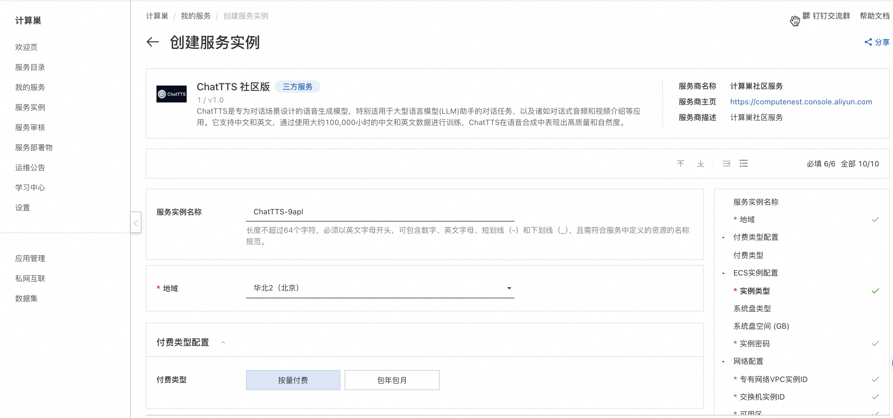

<h1> Rapid Deployment ChatTTS Community Edition </h1>

<h2> Overview </h2>

ChatTTS is a speech generation model designed for conversational scenarios, especially for conversational tasks with large language model (LLM) assistants, and applications such as conversational audio and video presentations. It supports both Chinese and English, and by training with about 100,000 hours of Chinese and English data, ChatTTS demonstrate high quality and naturalness in speech synthesis. 

ChatTTS official website:<a href = "https://chattts.com/">https://chattts.com/</a>

<h2> Billing instructions </h2>

 The cost of the ChatTTS in calculating the nest mainly involves:

<ul>
<li> Selected vCPU and Memory Specifications </li>
<li> Disk capacity </li>
<li> Internet bandwidth </li>
</ul>

 Billing method: Pay-as-you-go (hourly)

 The estimated cost is visible in real time when the instance is created. 

<h2> Deployment Architecture </h2>

ChatTTS Community Edition is a stand-alone deployment architecture. 

<h2> Permissions required for RAM accounts </h2>

ChatTTS services need to access and create resources such as ECS and VPC. If you use a RAM user to create a service instance, you need to add the corresponding resource permissions to the account of the RAM user before creating the service instance. For more information about how to add RAM permissions, see <a href = "https://help.aliyun.com/document_detail/121945.html"> Authorize RAM users </a>.
. The required permissions are shown in the following table. 

<table>
<thead>
<tr>
<th> Permission policy name </th>
<th> Remarks </th>
</tr>
</thead>
<tbody>
<tr>
<td>AliyunECSFullAccess</td>
<td> Permissions to manage ECS </td>
</tr>
<tr>
<td>AliyunVPCFullAccess</td>
<td> Permissions for managing VPC networks </td>
</tr>
<tr>
<td>AliyunROSFullAccess</td>
<td> Manage permissions for Resource Orchestration Services (ROS) </td>
</tr>
<tr>
<td>AliyunComputeNestUserFullAccess</td>
<td> Manage user-side permissions for the compute nest service (ComputeNest) </td>
</tr>
<tr>
<td>AliyunCloudMonitorFullAccess</td>
<td> Permissions to manage CloudMonitor (CloudMonitor) </td>
</tr>
</tbody>
</table>

<h2> Deployment process </h2>

<ol>
<li> Click <a href = "https://computenest.console.aliyun.com/service/instance/create/cn-hangzhou?type=user&ServiceId=service-661348ba42bf469182de"> Deployment Link </a> to go to the Service Instance Deployment page. </li>
<li>
 Select the new ECS instance and configure the parameters according to the interface prompts. After the configuration is complete, click Next: Confirm Order. 

</li>
<li>
 Click Create Now and wait for the service instance to be created. 

</li>
<li>
 After the service instance is successfully created, go to the service instance details page. The ChatTTS login information is available on the Overview page. 

</li>
<li>
 Click the external network panel address to access the ChatTTS service. 

</li>
</ol>
